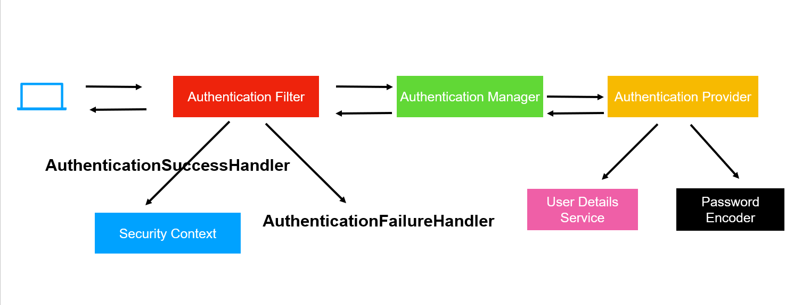
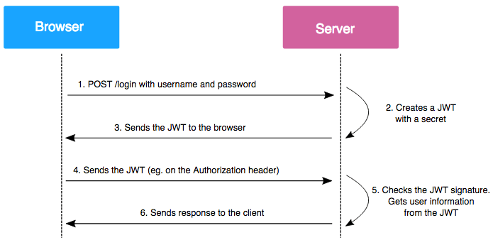

# Security Configuration

This Project makes use of Spring Security along with JWT token for authorization and authentication. The following is the breakdown of the config files and security files. All the headings point to the respective filename in the project

## CorsConfig
Cross-Origign Resource Sharing (CORS) is an HTTP-header based mechanism that allows an application or server indicate any origin which could be in the form of domain or port other than it's own address from which a browser should permit loading resources.

This implies that we can specify the exact address from where our server will accept requests (usually our frontend) any other server/application trying to contact our server will be rejected.

In the class CorsConfig we implement WebMvcConfigurer and customize the the CorsMappings Registry. WebMvcConfigurer can be used to implement custom viewResolvers, exception Handling and other aspects of traditional Spring MVC. Here we are only focusing on the CORS filters. 

Add the origin domain in the form of -> 

```allowedOrigins("domain URL").allowCredentials(true) ```

Include the allowed request headers ->

```allowedHeaders("*")``` to allow all headers, can be customized


Include the allowed methods ->

```allowedMethods("GET","POST","PUT","DELETE","PATCH")``` to allow these specified http methods

---

## SpringSecurity Implementation

The SpringSecurity class has the annotations @Configuration which entails that there are multiple @Bean methods that may be processed by the spring container at runtime. The @EnableWebSecurity annotation is used for Spring Security Web support and integration with Spring MVC. We require this since we are providing custom authentication logic with AuthManagers, JWT etc.



### UserDetailsService()
This is injected to obtain the specific user data such as username and password at the time of authentication

### JwtRequestFilter()
This is a bean injected which is a custom filter for handling JWT token (explained later).

### PasswordEncoder()
Bean is used initialize the password Encoder to be used while storing and comparing passwords, here we are using BCrypt encoder.

### SecurityFilterChain()
This method is used to filter the requests received by the application, here we set which all endpoints can be accessed by which types of users. We can also specify the request method accepted by an endpoint. Any endpoint that does not follow the specified requestMatchers() is rejected with an error code of 4xx unauthorized.
We have also disabled csrf() for the version 1 for simplicity, will be enabled in later versions to prevent cross site resource forgery attacks.

The last filter which is RequestMatcher("/api/admin/**).authenticated() ensures only authenticated users can access the admin endpoints.

The addFilterBefore() method is used to add a particular custom filter (in our case is JwtRequestFilter) before a known filter which will be applied by spring security which in this case is the UsernamePasswordAuthenticationFilter.
We are simply asking spring to perform JWT Filter and validate the JWT token before the final username password auth occurs which returns response as success or failed to user.

### Configure()
This method is used to configure the AuthenticationManager to use the userDetailsService and the specified passwordEncoder. We have overriden the methods of these 2 and hence need to direct Spring to use these and not the default.

### AuthenticationManager()
Define the custom auth manager to use the auth managerbuilder from HttpSecurity to build the authManager at runtime.

---

## CustomCustomerDetailsService

This is a custom implementation of the UserDetailsService which is used to retreive user data at the time of auth. This is marked with @Service annotation as it is a service provider during authentication.

We initialize a customerRepository instance to interact with the database.

### loadUserByUsername()
We override this method to retreive the user by username from the database using the customerRepository. The username here is the email, the repo finds the user by email and returns a customer. If the customer is null throw exception.

If the customer is found, we create a new user bean and pass the email and password which is used for authentication, along with this we pass the role to differentiate between normal user and admin.

---

## JwtUtil
This is a utility class for the implementation of JWT authentication which is initially only done for admin access.

A JSON Web Token (JWT) is a standard (RFC 7519) for securely transmitting information between parties as a JSON object. This information can be verified and trusted because it is digitally signed.



Here we set a private string secret_key which is used to generate the JWT token during auth.

### generateToken()
Here we invoke the Jwts.builder() method in order to generate a new token based on the parameters we provide, this is invoked every time a new authentication attempt occurs. The parameters are as follows:

setSubject(email) -> We initialize the subject with the email, this acts as the identifier for that principal (user) during the auth

setIssuedAt(new Date()) -> This is used to set the time of the creation of the token, this is necessary to check for expiration of the token

setExpiration(new Date(System.currentTimeMillis() + 1000 * 60 * 60 * 10)) -> This method is used to specify the tie after which the token expires after which the user will have to re-login. Currently for testing purposes it has been set to 10 hours

signWith(SignatureAlgorithm.HS256, Secret_Key) -> This is used to sign the JWT token using the SHA-256 hashing algorithm along with our secret_key. This signature is unique and combines both of them to ensure the integrity and authenticity of the JWT token created.

compact() -> This is used to compact the JWT into a URL-safe string


### extractEmail()
This method is used to extract the email from the token, for this we invoke the jwts.parser and pass our secret_key to parse the token and extract the subject() which is our email(our identifier of principal)

### extractExpiration()
This method is used to extract the expiration date

### isTokenExpired()
This method is used to check if the token has expired by comparing with current date()

### validateToken()
We use this method to check if the email provided during checking of the token is same as the email used initially during login. This is to ensure if any third party user gains access to your token, they must also have your email in the client local storage (from where this is pulled) of the application in order to identify as you. We also check expiration of the token before validating.

---

## AdminAuthenticationToken

This is a custom implementation of the AbstractAuthenticationToken class. We are using this since we want to specifically perform JWT authentication for admin users only (for now)

We intialize a final principal object which will hold the details of the authenticated user, in our case it is a customer object (admin user). We are using object data type in order to use any type of customer or admin in future.

The two constructors are used to initialize the principal and to set the authenticated status to true.

### getCredentials()
This method returns the credentials associated with the authentication token. In this case, it returns null because the admin does not have credentials in this token.

---

## JwtRequestFilter

This is the filter class invoked in order to process the JWT token for each incoming HTTP request after authentication.

### doFilterInternal()
We override this class to accept the Http request and response servlet along with the filterChain from config. In this method, we first extractt the authroization header and then check and extract the JWT. When we pass the requests from the client, ensure the "bearer" token auth is used and this method will extract the email for identification and the JWT and "validate()" the token.

We then retrieve the customer details from the database using the email and validate the JWT and if the token is valid, we create a new adminAuthToken and set it in the security context.

Finally we call the filterChain to process the request and the response based on the filters we have configured there.